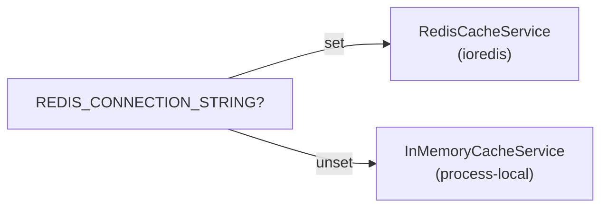

# Cache (Redis)

> **Opt-in:** install with `kl-nest new` (multiselect) or `kl-nest add cache`. OAuth2 and cron jobs may install in-memory cache implicitly (without `ioredis`).

The template exposes `ICacheService` to **cache data** in handlers — responses, heavy queries, aggregations, etc. The implementation is selected automatically from `.env`.

This guide focuses on **data caching**. The same service also stores OAuth2 `state` (anti-CSRF, short TTL) — see [State validation](../host/authentication.md#state-validation-flow-authenticity). The full OAuth2 flow is in [Authentication](../host/authentication.md#oauth2-any-provider-any-quantity).

## When to use

| Scenario | Redis recommended? |
| --- | --- |
| Caching handler responses or heavy queries | Optional (memory is fine in dev with 1 instance) |
| Data that changes slowly and can be briefly stale | Yes, with TTL + invalidation on update/delete |
| Multiple replicas needing the **same** data cache | Yes — memory is per process |
| Local development with a single instance | No — in-memory fallback works |

## Automatic implementation selection



| Variable | Implementation |
| --- | --- |
| `REDIS_CONNECTION_STRING` set | `RedisCacheService` (ioredis) |
| Redis unset | `InMemoryCacheService` (in-process Map) |

Registration in `InfraModule`:

```typescript
providers: [
  CacheServiceProvider,
  { provide: ICacheService, useExisting: CacheServiceProvider },
],
exports: [ICacheService, ILoggingService, IRedLockService],
```

Import `InfraModule` (or a module that re-exports it, such as `ControllerModule`) where your handler needs cache.

## Environment variables

```env
REDIS_CONNECTION_STRING=redis://localhost:6379
CACHE_KEY_PREFIX=koala-nest
```

| Variable | Description |
| --- | --- |
| `REDIS_CONNECTION_STRING` | Redis connection URL (optional for cache in dev) |
| `CACHE_KEY_PREFIX` | Redis key prefix (default: app name) |

On Redis, logical key `person:1` becomes `koala-nest:person:1`.

Zod schema details: [Environment variables](../getting-started/environment-variables.md).

## ICacheService API

Contract in `src/domain/common/icache.service.ts`:

```typescript
export abstract class ICacheService {
  abstract get(key: string): Promise<string | null>;
  abstract set(key: string, value: string, ttl?: number): Promise<void>;
  abstract invalidate(key: string): Promise<void>;
}
```

| Method | Behavior |
| --- | --- |
| `get(key)` | Returns the value or `null` if missing/expired |
| `set(key, value, ttl?)` | Stores a string; `ttl` in **seconds** (Redis uses `EX`) |
| `invalidate(key)` | Removes the key |

Values are **strings**. For objects, use `JSON.stringify` / `JSON.parse`.

## Usage in handlers

### Single item (`ReadPersonHandler`)

```typescript
import { ICacheService } from '@/domain/common/icache.service';
import { Injectable } from '@nestjs/common';

@Injectable()
export class ReadPersonHandler {
  constructor(
    private readonly repository: IPersonRepository,
    private readonly cache: ICacheService,
  ) {}

  async handle(id: number) {
    const cacheKey = `person:${id}`;
    const cached = await this.cache.get(cacheKey);

    if (cached) {
      return JSON.parse(cached) as ReadPersonResponse;
    }

    const person = await this.repository.findById(id);
    const response = AutoMapper.map(person, Person, ReadPersonResponse);

    await this.cache.set(cacheKey, JSON.stringify(response), 300);

    return response;
  }
}
```

### List (`ReadManyPersonHandler`)

The template already caches list results in `ReadManyPersonHandler` — the key includes pagination, sorting, and filters (`page`, `limit`, `name`, `active`, etc.):

```typescript
import { buildListCacheKey } from '@/core/utils/build-list-cache-key';
import { ICacheService } from '@/domain/common/icache.service';

@Injectable()
export class ReadManyPersonHandler {
  constructor(
    private readonly repository: IPersonRepository,
    private readonly cache: ICacheService,
  ) {}

  async handle(req: ReadManyPersonRequest) {
    const query = /* validate and map req → PersonQueryDto */;
    const cacheKey = buildListCacheKey('person:list', query);

    const cached = await this.cache.get(cacheKey);
    if (cached) {
      return ReadManyPersonResponse.from(JSON.parse(cached));
    }

    const response = /* repository.findMany + mapping */;
    await this.cache.set(cacheKey, JSON.stringify(response), 120);

    return response;
  }
}
```

Generated key (example): `person:list:{"active":true,"limit":10,"page":0}`.

Recommended patterns:

1. Namespace keys (`person:`, `person:list:`, etc.);
2. Set an explicit TTL for data that can go stale (lists often use shorter TTL — e.g. 120s);
3. Call `invalidate` on `create`/`update`/`delete` when cache is sensitive to changes — or use a short TTL on lists.

## Reference files

| File | Role |
| --- | --- |
| `domain/common/icache.service.ts` | Abstract contract |
| `infra/common/cache-service.provider.ts` | Picks Redis or memory |
| `infra/common/redis-cache.service.ts` | ioredis implementation |
| `infra/common/in-memory-cache.service.ts` | Local fallback |
| `infra/infra.module.ts` | Nest registration and exports |
| `application/person/read-many/read-many-person.handler.ts` | Real list caching example |
| `core/utils/build-list-cache-key.ts` | Builds stable keys from list filters |

## Tests

| File | Coverage |
| --- | --- |
| `test/infra/in-memory-cache.service.spec.ts` | TTL, get/set, invalidate |
| `test/infra/redis-cache.service.spec.ts` | Key prefix |
| `test/infra/cache-service.provider.spec.ts` | Fallback without Redis |
| `test/application/read-many-person.handler.spec.ts` | List cache hit |

## Related reading

- [Environment variables](../getting-started/environment-variables.md) — `REDIS_CONNECTION_STRING`, `CACHE_KEY_PREFIX`
- [Reusable bases](./reusable-bases.md) — `ICacheService` contract
- [Cron and Event Jobs](./cron-event-jobs.md) — distributed lock (another Redis use, not cache)
