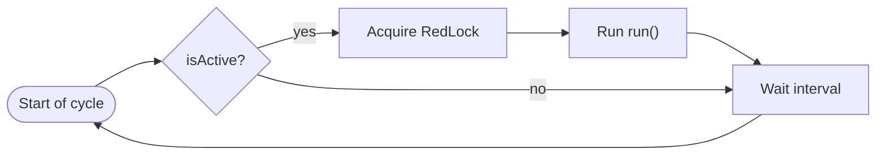
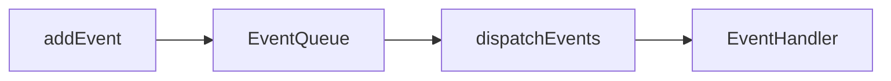

# Cron and Event Jobs

> **Opt-in:** install with `kl-nest new` (multiselect) or `kl-nest add cron` / `kl-nest add events`. Cron jobs require in-memory cache (installed automatically when needed).

Koala Nest provides two background mechanisms in `src/core/background-services/` (copied by the CLI when the feature is selected):

| Mechanism | Base class | Use |
| --- | --- | --- |
| **CronJob** | `CronJobHandlerBase` | Periodic tasks with cron expression or fixed interval |
| **EventJob** | `EventJob` + `EventHandlerBase` | React to domain events queued in memory |

The **CRUD Sample** template includes implementations in the Person module and installs cron/event jobs automatically. Bootstrap in `main.ts` calls `bootstrapKoalaJobs()` when cron jobs are present.

## Flow overview

The diagram below summarizes how **CronJob** and **EventJob** relate in the Person template:

**CronJob — periodic loop**



`run()` calls `addEvent` and starts the **EventJob**:

**EventJob — event reaction**



**CronJob:** `CreatePersonJob` runs on a cycle, creates a person, and fires events. **EventJob:** `InactivePersonHandler` reacts to the queued event and deactivates active people.

## CronJob

### How it works

`CronJobHandlerBase` runs an infinite loop:

1. Reads `settings()` — `isActive` and `timeInMinutes`;
2. If active, tries to acquire a distributed lock (`IRedLockService`);
3. Runs `run()`;
4. On error, reports via `ILoggingService`;
5. Waits for the interval and releases the lock.

### Scheduling with a cron expression

The recommended pattern combines **two values** in `settings()`:

| Field | Role |
| --- | --- |
| `timeInMinutes` | Loop polling frequency (e.g. `0.01` ≈ 0.6 s) |
| `isActive` | Whether the job runs this cycle — use `cronExpressionToBoolean('...')` |

The `cronExpressionToBoolean` helper (`src/core/utils/cron-expression-to-boolean.ts`) uses a **6-field cron**:

```
second  minute  hour  day-of-month  month  day-of-week
```

Examples:

| Expression | When it runs |
| --- | --- |
| `'0 */1 * * * *'` | Every minute |
| `'0 */10 * * * *'` | Every 10 minutes |
| `'0 0 0 * * *'` | Every day at midnight |

Use a low `timeInMinutes` (e.g. `0.01`) with a cron expression so the loop does not miss the one-second execution window.

For **fixed-interval** jobs without cron, keep `isActive: true` and a higher `timeInMinutes` (e.g. `120` for 2 hours).

```typescript
import {
  DemoCronExpression,
  DEMO_CRON_POLL_MINUTES,
} from '@/core/constants/cron.constants';
import { demoCronSettings } from '@/core/background-services/cron-service/cron-job.handler.base';

protected async settings(): Promise<CronJobSettings> {
  return demoCronSettings(
    DemoCronExpression.HOURLY,
    DEMO_CRON_POLL_MINUTES,
  );
}
```

```typescript
// src/core/background-services/cron-service/cron-job.handler.base.ts
export interface CronJobSettings {
  isActive: boolean;
  timeInMinutes: number;
}

export abstract class CronJobHandlerBase {
  protected abstract run(): Promise<void>;
  protected abstract settings(): Promise<CronJobSettings>;
  async start(): Promise<void> { /* loop with RedLock + delay */ }
}
```

### Example: DeleteInactiveJob

Removes inactive people every minute (educational example):

```typescript
import { DemoCronExpression } from '@/core/constants/cron.constants';
import { demoCronSettings } from '@/core/background-services/cron-service/cron-job.handler.base';

@Injectable()
export class DeleteInactiveJob extends CronJobHandlerBase {
  // ...

  protected async settings(): Promise<CronJobSettings> {
    return demoCronSettings(DemoCronExpression.HOURLY);
  }
```

### Register at bootstrap

1. Declare the job as a Nest `provider` (e.g. in `PersonModule`);
2. Register in `main.ts` via `bootstrapKoalaJobs()`:

```typescript
// src/host/main.ts
await bootstrapKoalaJobs(app, {
  cronJobsEnabled: config.get('CRON_JOBS_ENABLED'),
  bootstrapDelayMs: config.get('BOOTSTRAP_DELAY_MS'),
});
```

By default, `CRON_JOBS_ENABLED=false`. Use `BOOTSTRAP_DELAY_MS` if dependencies need warm-up before jobs.

## EventJob

### How it works

Events are queued in an aggregate (`EventJob`) and dispatched explicitly:

1. Create an `EventJob` subclass with `defineHandlers()`;
2. Instantiate events (`EventClass`) and call `addEvent()`;
3. Call `EventQueue.dispatchEventsForAggregate(jobs._id)`;
4. Handlers registered at bootstrap receive the event in `handleEvent()`.

```typescript
// Event
export class InactivePersonEvent extends EventClass {}

// Event aggregate
export class PersonEventJob extends EventJob<Person> {
  defineHandlers(): Type<EventHandlerBase>[] {
    return [InactivePersonHandler];
  }
}

// Handler
@Injectable()
export class InactivePersonHandler extends EventHandlerBase {
  constructor(private readonly repository: IPersonRepository) {
    super(InactivePersonEvent);
  }

  async handleEvent(_event: InactivePersonEvent): Promise<void> {
    // deactivate active people...
  }
}
```

### Dispatch events from a CronJob

`CreatePersonJob` creates a person and fires the inactivation event:

```typescript
const jobs = new PersonEventJob();
jobs.addEvent(new InactivePersonEvent());
EventQueue.dispatchEventsForAggregate(jobs._id);
```

### Register handlers

```typescript
const inactivePersonHandler = await app.resolve(InactivePersonHandler);
inactivePersonHandler.setupSubscriptions();
```

`setupSubscriptions()` binds `handleEvent` to the internal queue (`EventQueue`).

## Distributed lock (cron across replicas)

When the API runs on **multiple machines** (Kubernetes, load balancer, etc.), each instance starts the same CronJob loop. `IRedLockService` ensures **only one instance runs `run()` per cycle**, using a shared Redis key (`CacheKeyPrefix.RED_LOCK` + job name).

Per-cycle flow:

1. All instances check `settings().isActive`;
2. The first to acquire the Redis lock runs `run()`;
3. The others **skip** execution for that cycle;
4. The holder releases the lock when done (TTL expires as a fallback).

| Scenario | Behavior |
| --- | --- |
| `REDIS_CONNECTION_STRING` set | Atomic lock via Redis (`SET NX`) — **recommended** with replicas |
| Redis missing or `NODE_ENV=test` | Lock skipped — each instance runs locally (dev/test) |

```env
CRON_JOBS_ENABLED=false
BOOTSTRAP_DELAY_MS=0
# REDIS_CONNECTION_STRING=redis://localhost:6379
```

## Create a new CronJob

1. Create `src/application/<resource>/jobs/my-job.ts` extending `CronJobHandlerBase`;
2. Inject `IRedLockService`, `ILoggingService`, and required handlers;
3. Implement `settings()` and `run()`;
4. Register as a Nest `provider`;
5. Add `.addCronJob(MyJob)` in `main.ts`.

## Create a new EventJob

1. Create events in `src/application/<resource>/events/*.event.ts` extending `EventClass`;
2. Create handlers extending `EventHandlerBase` with `super(MyEvent)`;
3. Create `*-event.job.ts` with `defineHandlers()` listing handlers;
4. Register handlers as `provider` and call `setupSubscriptions()` in `main.ts`;
5. Where the event should fire, instantiate `EventJob`, `addEvent()`, and `dispatchEventsForAggregate()`.

## Tests

The template includes unit tests:

- `src/test/core/cron-job.handler.spec.ts` — loop and `run()` execution;
- `src/test/core/cron-expression-to-boolean.spec.ts` — cron expression validation;
- `src/test/core/event-queue.spec.ts` — handler registration and dispatch;
- `src/test/application/create-person.job.spec.ts` — CronJob → EventQueue integration.

Use `FakeRedLockService` and `EventQueue.clearHandlers()` / `clearMarkedAggregates()` in `beforeEach` to isolate tests.

## Reference files (Person module)

| File | Role |
| --- | --- |
| `application/person/jobs/create-person.job.ts` | CronJob that creates a person and fires an event |
| `application/person/jobs/delete-inactive.job.ts` | CronJob that removes inactive records |
| `application/person/events/person-event.job.ts` | Person event aggregate |
| `application/person/events/inactive-person.handler.ts` | Inactivation event handler |
| `host/main.ts` | Job startup at bootstrap |
| `host/main.ts` | Job registration at bootstrap |

## Related reading

- [Project structure](../getting-started/project-structure.md) — bootstrap in `main.ts`
- [Environment variables](../getting-started/environment-variables.md) — `REDIS_CONNECTION_STRING`, `CRON_JOBS_ENABLED`
- [Cache (Redis)](../core/cache.md) — `ICacheService` and handler usage
- [Person CRUD flow](../guides/person-crud-flow.md) — full example including jobs
- [Handlers](../application/handlers.md) — reuse existing handlers inside jobs
