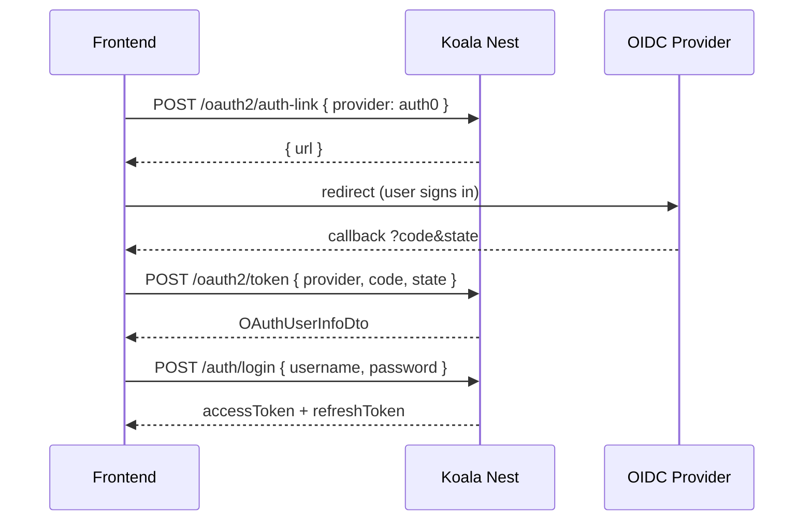
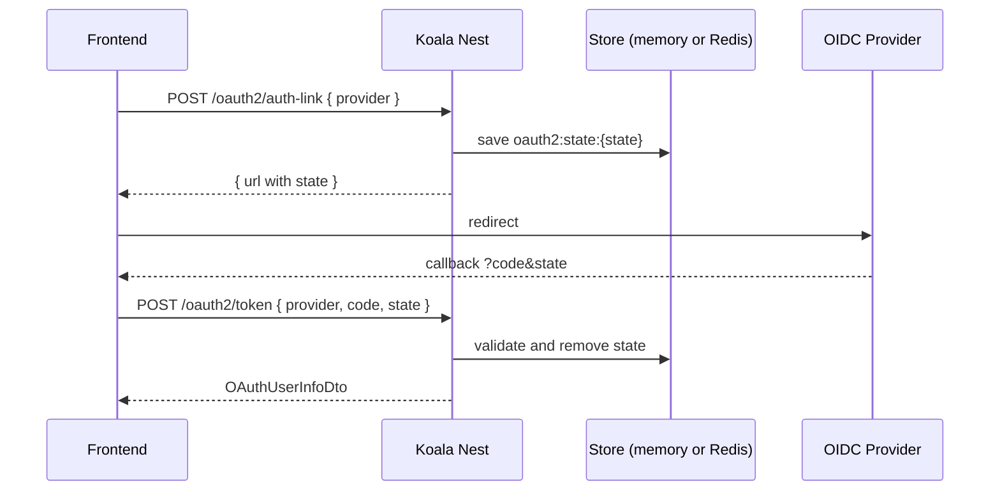

# Authentication

The authentication module is optional in the CLI (`kl-nest new` → **JWT** or **OAuth2**). With JWT, the template includes a `User` entity, email/password login, and RS256 token issuance. With OAuth2, users are created or reused after the authorization code flow.

## Main components

| Piece | Role |
| --- | --- |
| `SecurityModule` | Configures RS256 JWT, Passport, and token/OAuth2 services |
| `AuthGuard` | Global guard — validates Bearer token |
| `ProfilesGuard` | Global guard — restricts by token profile |
| `@IsPublic()` | Marks routes that bypass `AuthGuard` |
| `@RestrictionByProfile([AuthProfile.admin])` | Restricts endpoint to listed profiles |
| `ILoggedUserInfoService` | Request-scoped service for handlers/controllers |
| `AuthProfile` (`src/core/auth/auth-profile.enum.ts`) | String enum with supported profiles (`user`, `admin`) |
| `POST /auth/login` | Email/password login; issues access/refresh pair |
| `GET /auth/user-info` | Authenticated user data |
| `POST /auth/refresh` | Renews token pair using refresh token (Bearer or cookie) |

## Public routes

Routes with `@IsPublic()` bypass `AuthGuard` **and** do not require Bearer in OpenAPI/Scalar:

```typescript
import { IsPublic } from '@/host/decorators/is-public.decorator';

@Post('login')
@IsPublic()
handle() { ... }
```

All other endpoints are protected by default — no need for `@ApiBearerAuth()` on each controller.

## Profile restriction

The `profile` value comes from the user in the database (loaded by `AuthGuard` after JWT validation):

```typescript
import { AuthProfile } from '@/core/auth/auth-profile.enum';
import { RestrictionByProfile } from '@/host/decorators/restriction-by-profile.decorator';

@Delete(':id')
@RestrictionByProfile([AuthProfile.admin])
handle(@Param('id') id: string) { ... }
```

## Login (JWT password)

Public endpoint to authenticate with email and password:

```bash
POST /auth/login
Content-Type: application/json

{
  "username": "admin@example.com",
  "password": "admin123"
}
```

Response:

```json
{
  "accessToken": "...",
  "refreshToken": "..."
}
```

## Token refresh

Renew the access/refresh pair without re-authenticating:

```bash
POST /auth/refresh
Authorization: Bearer <refreshToken>
```

Or send the refresh token as an **httpOnly cookie** named `refreshToken` — `AuthGuard` promotes it to `Authorization` automatically on this route.

Response format matches `POST /auth/login` (`accessToken` + `refreshToken`). Refresh tokens are rejected on all other routes by `JwtStrategy`.

## Logged user in handlers

Inject `ILoggedUserInfoService` (same pattern as Globo Seguros / Solicita.ai):

```typescript
import { ILoggedUserInfoService } from '@/domain/services/ilogged-user-info.service';

@Injectable()
export class MyHandler {
  constructor(private readonly loggedUserInfo: ILoggedUserInfoService) {}

  async handle(req: MyRequest) {
    const user = this.loggedUserInfo.getUser();
  }
}
```

The service is request-scoped and reads `request.user` populated by `AuthGuard` after JWT validation.

## OAuth2 — any provider, any quantity

With the CLI (`kl-nest new` → **OAuth2**), the template ships a ready **authorization code** flow. The usual case is login with **third-party providers** (Google, Microsoft, Auth0, Keycloak, GitHub Enterprise, Okta, etc.) — you only fill credentials in `.env`. You do not reimplement `code` exchange, CSRF `state`, OIDC discovery, or controllers.

**Google and Microsoft in `.env.example` are just examples.** The library is generic: list as many providers as you need in `OAUTH2_PROVIDERS` and repeat the `OAUTH2_{KEY}_*` pattern for each. The `KEY` is the value you send in the body (`provider: "auth0"` → `OAUTH2_AUTH0_*`).

### What is already built (configure only)

| Piece | Role |
| --- | --- |
| `OAuthProviderRegistry` | Reads N providers from `OAUTH2_PROVIDERS` + `OAUTH2_{KEY}_*` variables |
| `OAuth2AuthService` | Generates `state`, builds auth URL, exchanges `code`, fetches userinfo |
| `POST /oauth2/auth-link` | Returns the authorization URL for the given provider |
| `POST /oauth2/token` | Exchanges `code` + `state` → `OAuthUserInfoDto` |
| Scalar | One OAuth2 scheme **per listed provider** at `/doc` |

### What you fill in (from the provider)

Created **outside** the API, in the IdP console:

| Data | Where to get it |
| --- | --- |
| `OAUTH2_PROVIDERS` | Comma-separated list — as many providers as you need |
| `OAUTH2_{KEY}_CLIENT_ID` / `_CLIENT_SECRET` | Provider console (Google Cloud, Azure, Auth0, …) |
| `OAUTH2_{KEY}_DOMAIN` | Provider OIDC issuer (automatic discovery) |
| `OAUTH2_{KEY}_SCOPE` | Scopes required by the provider |
| Registered `redirect_uri` | `API_HOST` + `/oauth2/callback` (or `OAUTH2_{KEY}_REDIRECT_PATH`) |

### Register an OIDC provider (pattern)

For **each** key in `OAUTH2_PROVIDERS`, add the `OAUTH2_{KEY}_*` block. Endpoints (`authorization`, `token`, `userinfo`) come from `/.well-known/openid-configuration`.

```env
OAUTH2_PROVIDERS=google,microsoft,auth0,keycloak
# --- google (example) ---
OAUTH2_GOOGLE_DOMAIN=https://accounts.google.com
OAUTH2_GOOGLE_CLIENT_ID=...
OAUTH2_GOOGLE_CLIENT_SECRET=...
OAUTH2_GOOGLE_SCOPE=openid profile email
# --- microsoft (example) ---
OAUTH2_MICROSOFT_DOMAIN=https://login.microsoftonline.com/common/v2.0
OAUTH2_MICROSOFT_CLIENT_ID=...
OAUTH2_MICROSOFT_CLIENT_SECRET=...
OAUTH2_MICROSOFT_SCOPE=openid profile email
# --- auth0 ---
OAUTH2_AUTH0_DOMAIN=https://tenant.auth0.com
OAUTH2_AUTH0_CLIENT_ID=...
OAUTH2_AUTH0_CLIENT_SECRET=...
OAUTH2_AUTH0_SCOPE=openid profile email
# --- keycloak ---
OAUTH2_KEYCLOAK_DOMAIN=https://idp.company.com/realms/prod
OAUTH2_KEYCLOAK_CLIENT_ID=...
OAUTH2_KEYCLOAK_CLIENT_SECRET=...
OAUTH2_KEYCLOAK_SCOPE=openid profile email
API_HOST=http://localhost:3000
```

End-to-end flow (any provider):



### Your own OAuth server (advanced)

When **you** host the server and it does **not** expose OIDC discovery, set URLs manually (no `_DOMAIN`):

```env
OAUTH2_PROVIDERS=myapp
OAUTH2_MYAPP_CLIENT_ID=...
OAUTH2_MYAPP_CLIENT_SECRET=...
OAUTH2_MYAPP_SCOPE=openid profile email
OAUTH2_MYAPP_AUTHORIZATION_URL=https://auth.myapp.com/oauth/authorize
OAUTH2_MYAPP_TOKEN_URL=https://auth.myapp.com/oauth/token
OAUTH2_MYAPP_USERINFO_URL=https://auth.myapp.com/oauth/userinfo
```

### State validation (flow authenticity)

On `POST /oauth2/auth-link`, the API generates a random `state` and stores it temporarily:

```
oauth2:state:{state} → { provider }   (10 min TTL)
```

On `POST /oauth2/token`, it checks the `state` exists, matches the request `provider`, and removes the key (one-time use). This ensures the `code` belongs to a flow **started by the API** — CSRF protection. The frontend (Angular, etc.) only forwards `code` and `state`; validation is **always server-side**, because the endpoint is public.

Implemented in `OAuth2AuthService` — uses `ICacheService` under the hood (temporary storage, not business data cache).

| Scenario | Behavior |
| --- | --- |
| **Single instance** (local dev) | `state` stays in memory (`InMemoryCacheService`) — **Redis not required** |
| **Multiple instances** (load balancer, K8s) | **Recommended** `REDIS_CONNECTION_STRING` — `auth-link` may run on replica A and `token` on B |



### What remains for the developer

The template does **not** persist users or issue API JWT automatically after OAuth. You decide:

1. Map `OAuthUserInfoDto` → claims (`sub`, `profile`, `email`);
2. Call `POST /auth/login` to issue the API JWT;
3. (Optional) create/update the user in the database before step 2.

## Bootstrap with guards

When the CLI installs authentication, `main.ts` registers global guards. Background jobs are started automatically by `JobsBootstrapService` via `JobsModule.register()` in `AppModule`:

```typescript
app.useGlobalGuards(
  await app.resolve(AuthGuard),
  await app.resolve(ProfilesGuard),
);
```

Job bootstrap subscribes to domain events and starts CronJobs only when `CRON_JOBS_ENABLED=true`. The delay before starting jobs is controlled by `BOOTSTRAP_DELAY_MS`.

## Authentication in Scalar

With authentication installed, Scalar obtains the JWT automatically via `authentication` in `apiReference`:

- **JWT:** **JWT** scheme (password flow) → `POST /auth/login`
- **OAuth2:** one scheme per provider (authorization code) → `POST /oauth2/scalar-token`

Full guide: [OpenAPI with Scalar](./openapi-scalar.md#automatic-scalar-authentication)

## Next steps

- [Environment variables](../getting-started/environment-variables.md) — JWT, OAuth2, and Redis keys
- [OpenAPI with Scalar](./openapi-scalar.md#automatic-scalar-authentication) — automatic Scalar configuration
- [Controllers](./controllers.md) — thin HTTP → handler pattern
