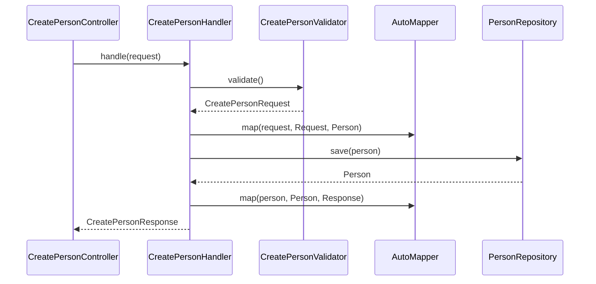

# DDD Architecture

Koala Nest organizes code into layers with clear responsibilities. Each layer depends only on inner layers, keeping the domain isolated from infrastructure and HTTP transport details.

## Layers

| Layer | Folder | Responsibility |
| --- | --- | --- |
| **Host** | `src/host` | HTTP entry: controllers, filters, OpenAPI, Nest modules |
| **Application** | `src/application` | Use cases: handlers, validators, requests/responses, mappings |
| **Domain** | `src/domain` | Rules and models: entities, query DTOs, repository contracts |
| **Infra** | `src/infra` | Concrete implementations: TypeORM, repositories, external services |
| **Core** | `src/core` | Cross-cutting utilities: env, bases, mapping tools |

## Request flow

The example below illustrates the path of `POST /person`:



## Dependency inversion

The domain defines **abstract contracts**; infrastructure provides **concrete implementations**. The handler depends on `IPersonRepository`, not on the TypeORM class:

```typescript
// src/domain/repositories/iperson.repository.ts
export abstract class IPersonRepository {
  abstract findMany(query: PersonQueryDto): Promise<ListResponse<Person>>;
  abstract findById(id: number): Promise<Person | null>;
  abstract save(person: Person): Promise<Person>;
  abstract delete(person: Person): Promise<void>;
}
```

```typescript
// src/infra/repositories/repository.module.ts
@Module({
  imports: [DatabaseModule],
  providers: [{ provide: IPersonRepository, useClass: PersonRepository }],
  exports: [DatabaseModule, IPersonRepository],
})
export class RepositoryModule {}
```

## Nest module composition

The import chain connects host → application → infra:

```typescript
// src/host/controllers/common/controller.module.ts
@Module({
  imports: [InfraModule],
  providers: [MappingProvider],
  exports: [InfraModule],
})
export class ControllerModule {}
```

```typescript
// src/host/controllers/person/person.module.ts
@Module({
  imports: [ControllerModule],
  controllers: [
    CreatePersonController,
    ReadPersonController,
    ReadManyPersonController,
    UpdatePersonController,
    DeletePersonController,
  ],
  providers: [
    CreatePersonHandler,
    ReadPersonHandler,
    ReadManyPersonHandler,
    UpdatePersonHandler,
    DeletePersonHandler,
  ],
})
export class PersonModule {}
```

## Related reading

- [Handlers](../application/handlers.md)
- [Repository contracts](../domain/contratos-repositorio.md)
- [Controllers](../host/controllers.md)
