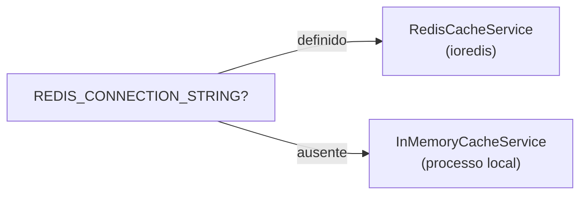

# Cache (Redis)

O template expõe `ICacheService` para **cachear dados** nos handlers — respostas, consultas pesadas, agregações, etc. A implementação é escolhida automaticamente conforme o `.env`.

Este guia foca em **cache de dados**. O mesmo serviço também grava o `state` do OAuth2 (anti-CSRF, TTL curto) — veja [Validação do `state`](../host/autenticacao.md#validacao-do-state-autenticidade-do-fluxo). O fluxo OAuth2 completo está em [Autenticação](../host/autenticacao.md#oauth2-qualquer-provedor-qualquer-quantidade).

## Quando usar

| Cenário | Redis recomendado? |
| --- | --- |
| Cache de respostas ou consultas pesadas no handler | Opcional (memória ok em dev com 1 instância) |
| Dados que mudam pouco e podem ficar stale por alguns segundos/minutos | Sim, com TTL + invalidação no update/delete |
| Várias réplicas precisando do **mesmo** cache de dados | Sim — memória é por processo |
| Desenvolvimento local com uma instância | Não — fallback em memória funciona |

## Seleção automática da implementação



| Variável | Implementação |
| --- | --- |
| `REDIS_CONNECTION_STRING` definido | `RedisCacheService` (ioredis) |
| Redis ausente | `InMemoryCacheService` (Map em memória, por processo) |

Registro no `InfraModule`:

```typescript
providers: [
  CacheServiceProvider,
  { provide: ICacheService, useExisting: CacheServiceProvider },
],
exports: [ICacheService, ILoggingService, IRedLockService],
```

Importe `InfraModule` (ou um módulo que o reexporte, como `ControllerModule`) no módulo onde o handler precisa do cache.

## Variáveis de ambiente

```env
REDIS_CONNECTION_STRING=redis://localhost:6379
CACHE_KEY_PREFIX=koala-nest
```

| Variável | Descrição |
| --- | --- |
| `REDIS_CONNECTION_STRING` | URL de conexão Redis (opcional para cache em dev) |
| `CACHE_KEY_PREFIX` | Prefixo de chaves no Redis (padrão: nome do app) |

No Redis, a chave lógica `person:1` vira `koala-nest:person:1`.

Detalhes do schema Zod: [Variáveis de ambiente](../inicio/variaveis-de-ambiente.md).

## API do ICacheService

Contrato em `src/domain/common/icache.service.ts`:

```typescript
export abstract class ICacheService {
  abstract get(key: string): Promise<string | null>;
  abstract set(key: string, value: string, ttl?: number): Promise<void>;
  abstract invalidate(key: string): Promise<void>;
}
```

| Método | Comportamento |
| --- | --- |
| `get(key)` | Retorna o valor ou `null` se ausente/expirado |
| `set(key, value, ttl?)` | Grava string; `ttl` em **segundos** (Redis usa `EX`) |
| `invalidate(key)` | Remove a chave |

Valores são **strings**. Para objetos, use `JSON.stringify` / `JSON.parse`.

## Uso em handlers

### Item único (`ReadPersonHandler`)

```typescript
import { ICacheService } from '@/domain/common/icache.service';
import { Injectable } from '@nestjs/common';

@Injectable()
export class ReadPersonHandler {
  constructor(
    private readonly repository: IPersonRepository,
    private readonly cache: ICacheService,
  ) {}

  async handle(id: number) {
    const cacheKey = `person:${id}`;
    const cached = await this.cache.get(cacheKey);

    if (cached) {
      return JSON.parse(cached) as ReadPersonResponse;
    }

    const person = await this.repository.findById(id);
    const response = AutoMapper.map(person, Person, ReadPersonResponse);

    await this.cache.set(cacheKey, JSON.stringify(response), 300);

    return response;
  }
}
```

### Listagem (`ReadManyPersonHandler`)

O template já cacheia listagens em `ReadManyPersonHandler` — a chave inclui paginação, ordenação e filtros (`page`, `limit`, `name`, `active`, etc.):

```typescript
import { buildListCacheKey } from '@/core/utils/build-list-cache-key';
import { ICacheService } from '@/domain/common/icache.service';

@Injectable()
export class ReadManyPersonHandler {
  constructor(
    private readonly repository: IPersonRepository,
    private readonly cache: ICacheService,
  ) {}

  async handle(req: ReadManyPersonRequest) {
    const query = /* valida e mapeia req → PersonQueryDto */;
    const cacheKey = buildListCacheKey('person:list', query);

    const cached = await this.cache.get(cacheKey);
    if (cached) {
      return ReadManyPersonResponse.from(JSON.parse(cached));
    }

    const response = /* repository.findMany + mapeamento */;
    await this.cache.set(cacheKey, JSON.stringify(response), 120);

    return response;
  }
}
```

Chave gerada (exemplo): `person:list:{"active":true,"limit":10,"page":0}`.

Padrão recomendado:

1. Namespace nas chaves (`person:`, `person:list:`, etc.);
2. TTL explícito para dados que podem ficar stale (listagens costumam ser mais curtas — ex. 120s);
3. `invalidate` no `create`/`update`/`delete` quando o cache for sensível a mudanças — ou TTL curto em listas.

## Arquivos de referência

| Arquivo | Função |
| --- | --- |
| `domain/common/icache.service.ts` | Contrato abstrato |
| `infra/common/cache-service.provider.ts` | Escolhe Redis ou memória |
| `infra/common/redis-cache.service.ts` | Implementação ioredis |
| `infra/common/in-memory-cache.service.ts` | Fallback local |
| `infra/infra.module.ts` | Registro e export no Nest |
| `application/person/read-many/read-many-person.handler.ts` | Exemplo real de cache em listagem |
| `core/utils/build-list-cache-key.ts` | Monta chave estável para filtros de lista |

## Testes

| Arquivo | Cobertura |
| --- | --- |
| `test/infra/in-memory-cache.service.spec.ts` | TTL, get/set, invalidate |
| `test/infra/redis-cache.service.spec.ts` | Prefixo de chave |
| `test/infra/cache-service.provider.spec.ts` | Fallback sem Redis |
| `test/application/read-many-person.handler.spec.ts` | Cache hit em listagem |

## Leituras relacionadas

- [Variáveis de ambiente](../inicio/variaveis-de-ambiente.md) — `REDIS_CONNECTION_STRING`, `CACHE_KEY_PREFIX`
- [Bases reutilizáveis](./bases-reutilizaveis.md) — contrato `ICacheService`
- [Cron e Event Jobs](./cron-event-jobs.md) — lock distribuído (outro uso do Redis, não é cache)
