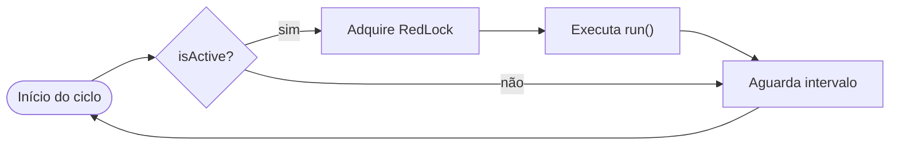
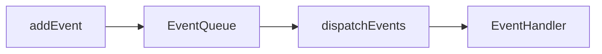

# Cron e Event Jobs

> **Opt-in:** instale com `kl-nest new` (multiselect) ou `kl-nest add cron` / `kl-nest add events`. Cron jobs exigem cache em memória (instalado automaticamente se necessário).

O Koala Nest inclui dois mecanismos de background em `src/core/background-services/` (copiados pela CLI quando a feature é selecionada):

| Mecanismo | Classe base | Uso |
| --- | --- | --- |
| **CronJob** | `CronJobHandlerBase` | Tarefas periódicas com expressão cron ou intervalo fixo |
| **EventJob** | `EventJob` + `EventHandlerBase` | Reação a eventos de domínio enfileirados em memória |

O template **Exemplo de CRUD** traz implementações no módulo Person e instala cron/event jobs automaticamente. Os handlers são registrados no `AppModule` via `JobsModule.register()` e iniciados de forma transparente pelo `JobsBootstrapService` (`OnModuleInit`).

## Estrutura de pastas

```
src/application/<recurso>/jobs/
├── cron/
│   └── *.job.ts
└── events/
    └── <recurso>/
        ├── *-event.job.ts
        └── <especialidade>/
            ├── *.event.ts
            └── *.handler.ts
```

Utilitários de agendamento: `CronExpression`, `DEFAULT_CRON_POLL_MINUTES` (`cron.constants.ts`) e `cronJobSettings()` (`cron-job.handler.base.ts`).

## Visão geral do fluxo

O diagrama abaixo resume como **CronJob** e **EventJob** se relacionam no template Person:

**CronJob — loop periódico**



`run()` chama `addEvent` e inicia o **EventJob**:

**EventJob — reação a eventos**



**CronJob:** `CreatePersonJob` roda em ciclo, cria uma pessoa e dispara eventos. **EventJob:** `InactivePersonHandler` reage ao evento enfileirado e inativa pessoas ativas.

## CronJob

### Como funciona

`CronJobHandlerBase` executa um loop infinito:

1. Lê `settings()` — `isActive` e `timeInMinutes`;
2. Se ativo, tenta adquirir lock distribuído (`IRedLockService`);
3. Executa `run()`;
4. Em caso de erro, reporta via `ILoggingService`;
5. Aguarda o intervalo e libera o lock.

### Agendamento com expressão cron

O padrão recomendado combina **dois valores** em `settings()`:

| Campo | Função |
| --- | --- |
| `timeInMinutes` | Frequência do polling do loop (ex.: `0.01` ≈ 0,6 s) |
| `isActive` | Se o job executa neste ciclo — use `cronExpressionToBoolean('...')` |

A função `cronExpressionToBoolean` (`src/core/utils/cron-expression-to-boolean.ts`) usa **cron de 6 campos**:

```
segundo  minuto  hora  dia-mês  mês  dia-semana
```

Exemplos:

| Expressão | Quando executa |
| --- | --- |
| `'*/15 * * * * *'` | A cada 15 segundos (template de exemplo) |
| `'0 */1 * * * *'` | A cada minuto |
| `'0 */10 * * * *'` | A cada 10 minutos |
| `'0 0 0 * * *'` | Todo dia à meia-noite |

Use `timeInMinutes` baixo (ex.: `0.01`) com expressão cron para o loop não perder a janela de execução de um segundo.

Para jobs que rodam em **intervalo fixo** sem cron, mantenha `isActive: true` e um `timeInMinutes` maior (ex.: `120` para 2 horas).

```typescript
import {
  CronExpression,
  DEFAULT_CRON_POLL_MINUTES,
} from '@/core/constants/cron.constants';
import { cronJobSettings } from '@/core/background-services/cron-service/cron-job.handler.base';

protected async settings(): Promise<CronJobSettings> {
  return cronJobSettings(
    CronExpression.EVERY_15_SECONDS,
    DEFAULT_CRON_POLL_MINUTES,
  );
}
```

```typescript
// src/core/background-services/cron-service/cron-job.handler.base.ts
export interface CronJobSettings {
  isActive: boolean;
  timeInMinutes: number;
}

export abstract class CronJobHandlerBase {
  protected abstract run(): Promise<void>;
  protected abstract settings(): Promise<CronJobSettings>;
  async start(): Promise<void> { /* loop com RedLock + delay */ }
}
```

### Exemplo: DeleteInactiveJob

Remove pessoas inativas a cada 15 segundos (exemplo didático — intervalo curto para demonstração em dev). O job pagina via `IPersonRepository.findMany` em lotes de 100 para não depender do limite padrão de listagem:

```typescript
import { CronExpression } from '@/core/constants/cron.constants';
import { cronJobSettings } from '@/core/background-services/cron-service/cron-job.handler.base';

@Injectable()
export class DeleteInactiveJob extends CronJobHandlerBase {
  // ...

  protected async settings(): Promise<CronJobSettings> {
    return cronJobSettings(CronExpression.EVERY_15_SECONDS);
  }
```

### Registrar no AppModule

Passe as classes de handler e cron job em `JobsModule.register()` no `AppModule`. Informe em `imports` os módulos que exportam as dependências dos handlers (no exemplo CRUD: `PersonModule`, que reexporta o `ControllerModule` com a infra). O Nest instancia os providers e o `JobsBootstrapService` inscreve eventos e inicia cron jobs automaticamente:

```typescript
// src/host/app.module.ts
import { JobsModule } from './jobs/jobs.module';
import { PersonModule } from './controllers/person/person.module';
import { InactivePersonHandler } from '@/application/person/jobs/events/person/inactive-person/inactive-person.handler';
import { CreatePersonJob } from '@/application/person/jobs/cron/create-person.job';
import { DeleteInactiveJob } from '@/application/person/jobs/cron/delete-inactive.job';

@Module({
  imports: [
    JobsModule.register({
      imports: [PersonModule],
      eventHandlers: [InactivePersonHandler],
      cronJobs: [CreatePersonJob, DeleteInactiveJob],
    }),
    // ...demais módulos
  ],
})
export class AppModule {}
```

No template **Padrão**, os arrays ficam vazios até você adicionar seus próprios handlers:

```typescript
JobsModule.register({
  eventHandlers: [],
  cronJobs: [],
})
```

No template de exemplo, `CRON_JOBS_ENABLED=true` no `.env.example`. Use `BOOTSTRAP_DELAY_MS` se precisar aguardar dependências antes dos jobs.

## EventJob

### Como funciona

Eventos são enfileirados em um agregado (`EventJob`) e despachados explicitamente:

1. Crie uma subclasse de `EventJob` com `defineHandlers()`;
2. Instancie eventos (`EventClass`) e chame `addEvent()`;
3. Chame `EventQueue.dispatchEventsForAggregate(jobs._id)`;
4. Handlers registrados no `JobsModule` recebem o evento em `handleEvent()`.

```typescript
// Evento
export class InactivePersonEvent extends EventClass {}

// Agregado de eventos
export class PersonEventJob extends EventJob<Person> {
  defineHandlers(): Type<EventHandlerBase>[] {
    return [InactivePersonHandler];
  }
}

// Handler
@Injectable()
export class InactivePersonHandler extends EventHandlerBase {
  constructor(private readonly repository: IPersonRepository) {
    super(InactivePersonEvent);
  }

  async handleEvent(_event: InactivePersonEvent): Promise<void> {
    // inativa pessoas ativas...
  }
}
```

### Disparar eventos a partir de um CronJob

O `CreatePersonJob` cria uma pessoa e dispara o evento de inativação:

```typescript
const jobs = new PersonEventJob();
jobs.addEvent(new InactivePersonEvent());
EventQueue.dispatchEventsForAggregate(jobs._id);
```

### Registrar handlers

O `JobsBootstrapService` chama `setupSubscriptions()` em cada handler listado em `eventHandlers` durante o `OnModuleInit` do Nest — não é necessário código manual em `main.ts`.

## Lock distribuído (cron em múltiplas instâncias)

Quando a API roda em **várias máquinas** (Kubernetes, load balancer, etc.), cada instância inicia o mesmo loop de CronJob. O `IRedLockService` garante que **apenas uma instância execute `run()` por ciclo**, usando uma chave compartilhada no Redis (`CacheKeyPrefix.RED_LOCK` + nome do job).

Fluxo por ciclo:

1. Todas as instâncias checam `settings().isActive`;
2. A primeira que conseguir o lock no Redis executa `run()`;
3. As demais **pulam** a execução naquele ciclo;
4. Quem adquiriu o lock libera ao terminar (ou o TTL expira como fallback).

| Cenário | Comportamento |
| --- | --- |
| `REDIS_CONNECTION_STRING` definido | Lock atômico via Redis (`SET NX`) — **recomendado** com réplicas |
| Redis ausente ou `NODE_ENV=test` | Lock ignorado — cada instância executa localmente (dev/test) |

```env
CRON_JOBS_ENABLED=true
BOOTSTRAP_DELAY_MS=0
# REDIS_CONNECTION_STRING=redis://localhost:6379
```

## Criar um novo CronJob

1. Crie `src/application/<recurso>/jobs/cron/meu-job.ts` estendendo `CronJobHandlerBase`;
2. Injete `IRedLockService`, `ILoggingService` e os handlers necessários;
3. Implemente `settings()` e `run()`;
4. Adicione a classe em `cronJobs` no `JobsModule.register()` do `AppModule`.

## Criar um novo EventJob

1. Crie eventos em `src/application/<recurso>/jobs/events/<especialidade>/*.event.ts` estendendo `EventClass`;
2. Crie handlers em `src/application/<recurso>/jobs/events/<especialidade>/` estendendo `EventHandlerBase` com `super(MeuEvent)`;
3. Crie `*-event.job.ts` em `src/application/<recurso>/jobs/events/<recurso>/` com `defineHandlers()` listando os handlers;
4. Adicione os handlers em `eventHandlers` no `JobsModule.register()` do `AppModule`;
5. Onde o evento deve ocorrer, instancie o `EventJob`, `addEvent()` e `dispatchEventsForAggregate()`.

## Testes

O template inclui testes unitários:

- `src/test/core/cron-job.handler.spec.ts` — loop e execução do `run()`;
- `src/test/core/cron-expression-to-boolean.spec.ts` — validação de expressões cron;
- `src/test/core/event-queue.spec.ts` — registro e dispatch de handlers;
- `src/test/application/create-person.job.spec.ts` — integração CronJob → EventQueue.

Use `FakeRedLockService` e `EventQueue.clearHandlers()` / `clearMarkedAggregates()` no `beforeEach` para isolar testes.

## Arquivos de referência (módulo Person)

| Arquivo | Função |
| --- | --- |
| `application/person/jobs/cron/create-person.job.ts` | CronJob que cria pessoa e dispara evento |
| `application/person/jobs/cron/delete-inactive.job.ts` | CronJob que remove inativos |
| `application/person/jobs/events/person/person-event.job.ts` | Agregado de eventos Person |
| `application/person/jobs/events/person/inactive-person/inactive-person.event.ts` | Evento de inativação |
| `application/person/jobs/events/person/inactive-person/inactive-person.handler.ts` | Handler do evento de inativação |
| `host/jobs/jobs.module.ts` | Registro plug-and-play de handlers e cron jobs |
| `host/jobs/jobs-bootstrap.service.ts` | Inicialização automática no `OnModuleInit` |

## Leituras relacionadas

- [Estrutura do projeto](../inicio/estrutura-do-projeto.md) — `JobsModule.register()` no `AppModule`
- [Variáveis de ambiente](../inicio/variaveis-de-ambiente.md) — `REDIS_CONNECTION_STRING`, `CRON_JOBS_ENABLED`
- [Cache (Redis)](../core/cache.md) — `ICacheService` e uso em handlers
- [Fluxo CRUD Person](../guias/fluxo-crud-person.md) — exemplo completo incluindo jobs
- [Handlers](../application/handlers.md) — reutilize handlers existentes dentro de jobs
