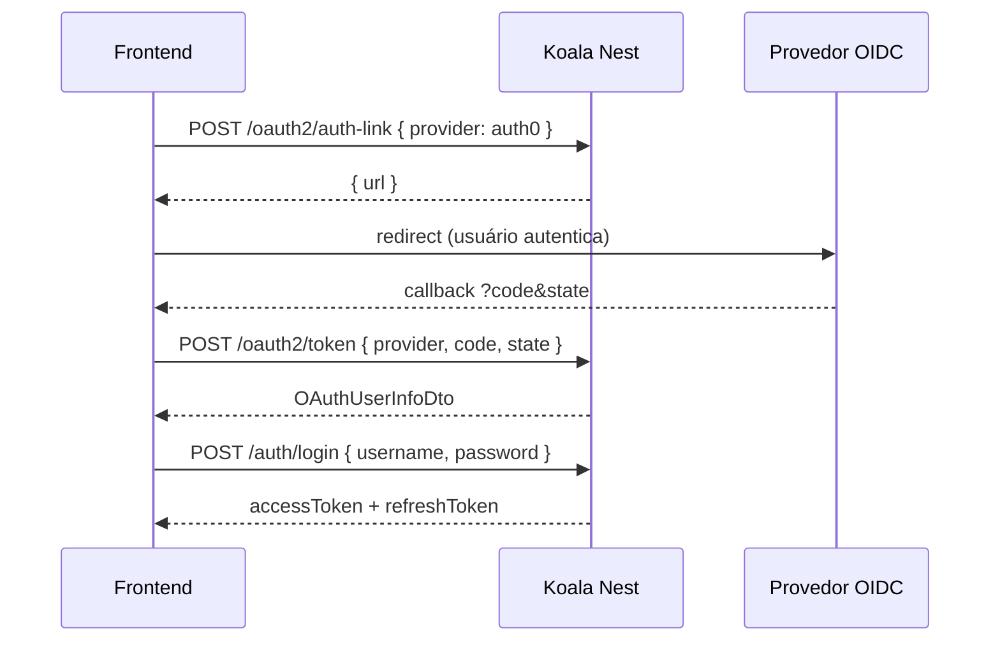
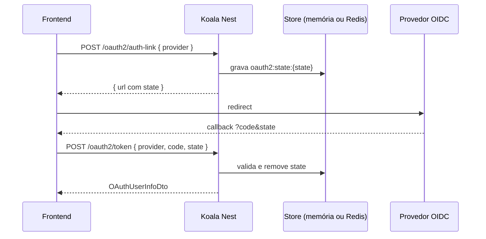

# Autenticação

O módulo de autenticação é opcional na CLI (`kl-nest new` → **JWT** ou **OAuth2** ). Com JWT, o template inclui entidade `User`, login por e-mail/senha e emissão de tokens RS256. Com OAuth2, usuários são criados ou reutilizados após o fluxo authorization code.

## Componentes principais

| Peça | Função |
| --- | --- |
| `SecurityModule` | Configura JWT RS256, Passport e serviços de token/OAuth2 |
| `AuthGuard` | Guard global — valida Bearer token |
| `ProfilesGuard` | Guard global — restringe por perfil do token |
| `@IsPublic()` | Marca rotas que ignoram o `AuthGuard` |
| `@RestrictionByProfile([AuthProfile.admin])` | Restringe endpoint aos perfis informados |
| `ILoggedUserInfoService` | Serviço request-scoped para handlers/controllers |
| `AuthProfile` (`src/core/auth/auth-profile.enum.ts`) | Enum de string com perfis suportados (`user`, `admin`) |
| `POST /auth/login` | Login com e-mail/senha; emite par access/refresh |
| `GET /auth/user-info` | Dados do usuário autenticado |
| `POST /auth/refresh` | Renova o par de tokens com refresh token (Bearer ou cookie) |

## Rotas públicas

Rotas com `@IsPublic()` ignoram o `AuthGuard` **e** deixam de exigir Bearer no OpenAPI/Scalar:

```typescript
import { IsPublic } from '@/host/decorators/is-public.decorator';

@Post('login')
@IsPublic()
handle() { ... }
```

Demais endpoints são protegidos por padrão — não é necessário `@ApiBearerAuth()` em cada controller.

## Restrição por perfil

O valor de `profile` vem do usuário no banco (carregado pelo `AuthGuard` após validar o JWT):

```typescript
import { AuthProfile } from '@/core/auth/auth-profile.enum';
import { RestrictionByProfile } from '@/host/decorators/restriction-by-profile.decorator';

@Delete(':id')
@RestrictionByProfile([AuthProfile.admin])
handle(@Param('id') id: string) { ... }
```

## Login (JWT password)

Endpoint público para autenticar com e-mail e senha:

```bash
POST /auth/login
Content-Type: application/json

{
  "username": "admin@example.com",
  "password": "admin123"
}
```

Resposta:

```json
{
  "accessToken": "...",
  "refreshToken": "..."
}
```

## Renovação de token

Renove o par access/refresh sem autenticar novamente:

```bash
POST /auth/refresh
Authorization: Bearer <refreshToken>
```

Ou envie o refresh token como **cookie httpOnly** `refreshToken` — o `AuthGuard` promove automaticamente para `Authorization` nesta rota.

O formato da resposta é o mesmo de `POST /auth/login` (`accessToken` + `refreshToken`). Refresh tokens são rejeitados em todas as demais rotas pelo `JwtStrategy`.

## Usuário logado nos handlers

Injete `ILoggedUserInfoService` (mesmo padrão de Globo Seguros / Solicita.ai):

```typescript
import { ILoggedUserInfoService } from '@/domain/services/ilogged-user-info.service';

@Injectable()
export class MyHandler {
  constructor(private readonly loggedUserInfo: ILoggedUserInfoService) {}

  async handle(req: MyRequest) {
    const user = this.loggedUserInfo.getUser();
  }
}
```

O serviço é request-scoped e lê o `request.user` preenchido pelo `AuthGuard` após validar o JWT.

## OAuth2 — qualquer provedor, qualquer quantidade

Na CLI (`kl-nest new` → **OAuth2**), o template entrega o fluxo **authorization code** pronto. O caso usual é login com **provedores terceiros** (Google, Microsoft, Auth0, Keycloak, GitHub Enterprise, Okta, etc.) — você só preenche credenciais no `.env`. Não reimplementa troca de `code`, `state` CSRF, discovery OIDC nem controllers.

**Google e Microsoft no `.env.example` são apenas exemplos.** A lib é genérica: liste quantos providers quiser em `OAUTH2_PROVIDERS` e repita o padrão `OAUTH2_{CHAVE}_*` para cada um. A `CHAVE` é o valor que você envia no body (`provider: "auth0"` → `OAUTH2_AUTH0_*`).

### O que já vem pronto (só configurar)

| Peça | Função |
| --- | --- |
| `OAuthProviderRegistry` | Lê N providers de `OAUTH2_PROVIDERS` + variáveis `OAUTH2_{CHAVE}_*` |
| `OAuth2AuthService` | Gera `state`, monta auth URL, troca `code` por token, busca userinfo |
| `POST /oauth2/auth-link` | Retorna URL de autorização do provedor informado |
| `POST /oauth2/token` | Troca `code` + `state` → `OAuthUserInfoDto` |
| Scalar | Um esquema OAuth2 **por provider** listado em `/doc` |

### O que você preenche (dados do provedor)

Gerados **fora** da API, no console do IdP:

| Dado | Onde obter |
| --- | --- |
| `OAUTH2_PROVIDERS` | Lista separada por vírgula — quantos providers precisar |
| `OAUTH2_{CHAVE}_CLIENT_ID` / `_CLIENT_SECRET` | Console do provedor (Google Cloud, Azure, Auth0, …) |
| `OAUTH2_{CHAVE}_DOMAIN` | Issuer OIDC do provedor (discovery automático) |
| `OAUTH2_{CHAVE}_SCOPE` | Scopes exigidos pelo provedor |
| `redirect_uri` registrado | `API_HOST` + `/oauth2/callback` (ou `OAUTH2_{CHAVE}_REDIRECT_PATH`) |

### Registrar um provedor OIDC (padrão)

Para **cada** chave em `OAUTH2_PROVIDERS`, adicione o bloco `OAUTH2_{CHAVE}_*`. Endpoints (`authorization`, `token`, `userinfo`) vêm do `/.well-known/openid-configuration`.

```env
OAUTH2_PROVIDERS=google,microsoft,auth0,keycloak
# --- google (exemplo) ---
OAUTH2_GOOGLE_DOMAIN=https://accounts.google.com
OAUTH2_GOOGLE_CLIENT_ID=...
OAUTH2_GOOGLE_CLIENT_SECRET=...
OAUTH2_GOOGLE_SCOPE=openid profile email
# --- microsoft (exemplo) ---
OAUTH2_MICROSOFT_DOMAIN=https://login.microsoftonline.com/common/v2.0
OAUTH2_MICROSOFT_CLIENT_ID=...
OAUTH2_MICROSOFT_CLIENT_SECRET=...
OAUTH2_MICROSOFT_SCOPE=openid profile email
# --- auth0 ---
OAUTH2_AUTH0_DOMAIN=https://tenant.auth0.com
OAUTH2_AUTH0_CLIENT_ID=...
OAUTH2_AUTH0_CLIENT_SECRET=...
OAUTH2_AUTH0_SCOPE=openid profile email
# --- keycloak ---
OAUTH2_KEYCLOAK_DOMAIN=https://idp.empresa.com/realms/prod
OAUTH2_KEYCLOAK_CLIENT_ID=...
OAUTH2_KEYCLOAK_CLIENT_SECRET=...
OAUTH2_KEYCLOAK_SCOPE=openid profile email
API_HOST=http://localhost:3000
```

Fluxo ponta a ponta (qualquer provider):



### Servidor OAuth próprio (avançado)

Quando **você** hospeda o servidor e ele **não** expõe discovery OIDC, defina URLs manualmente (sem `_DOMAIN`):

```env
OAUTH2_PROVIDERS=myapp
OAUTH2_MYAPP_CLIENT_ID=...
OAUTH2_MYAPP_CLIENT_SECRET=...
OAUTH2_MYAPP_SCOPE=openid profile email
OAUTH2_MYAPP_AUTHORIZATION_URL=https://auth.myapp.com/oauth/authorize
OAUTH2_MYAPP_TOKEN_URL=https://auth.myapp.com/oauth/token
OAUTH2_MYAPP_USERINFO_URL=https://auth.myapp.com/oauth/userinfo
```

### Validação do `state` (autenticidade do fluxo)

No `POST /oauth2/auth-link`, a API gera um `state` aleatório e grava temporariamente:

```
oauth2:state:{state} → { provider }   (TTL 10 min)
```

No `POST /oauth2/token`, confere se o `state` existe, bate com o `provider` do body e remove a chave (uso único). Isso garante que o `code` pertence a um fluxo **iniciado pela API** — proteção anti-CSRF. O frontend (Angular, etc.) só repassa `code` e `state`; a validação é **sempre no servidor**, pois o endpoint é público.

Implementação em `OAuth2AuthService` — usa `ICacheService` por baixo (armazenamento temporário, não cache de dados de negócio).

| Cenário | Comportamento |
| --- | --- |
| **1 instância** (dev local) | `state` fica em memória (`InMemoryCacheService`) — **Redis não é necessário** |
| **Várias instâncias** (load balancer, K8s) | **Recomendado** `REDIS_CONNECTION_STRING` — o `auth-link` pode rodar na réplica A e o `token` na B |



### O que fica com o desenvolvedor

O template **não persiste usuário** nem emite JWT automaticamente após OAuth. Você decide:

1. Mapear `OAuthUserInfoDto` → claims (`sub`, `profile`, `email`);
2. Chamar `POST /auth/login` para emitir JWT da API;
3. (Opcional) criar/atualizar usuário no banco antes do passo 2.

## Bootstrap com guards

Quando a CLI instala autenticação, o `main.ts` registra guards globais. Jobs em background são iniciados automaticamente pelo `JobsBootstrapService` via `JobsModule.register()` no `AppModule`:

```typescript
app.useGlobalGuards(
  await app.resolve(AuthGuard),
  await app.resolve(ProfilesGuard),
);
```

O bootstrap de jobs inscreve handlers de eventos e inicia CronJobs apenas quando `CRON_JOBS_ENABLED=true`. O atraso antes de iniciar os jobs é controlado por `BOOTSTRAP_DELAY_MS`.

## Autenticacao no Scalar

Com autenticação instalada, o Scalar obtém o JWT automaticamente via `authentication` no `apiReference`:

- **JWT:** esquema **JWT** (fluxo password) → `POST /auth/login`
- **OAuth2:** um esquema por provider (authorization code) → `POST /oauth2/scalar-token`

Guia completo: [OpenAPI com Scalar](./openapi-scalar.md#autenticacao-automatica-no-scalar)

## Próximos passos

- [Variáveis de ambiente](../inicio/variaveis-de-ambiente.md) — chaves JWT, OAuth2 e Redis
- [OpenAPI com Scalar](./openapi-scalar.md#autenticacao-automatica-no-scalar) — configuracao automatica no Scalar
- [Controllers](./controllers.md) — padrão fino HTTP → handler
