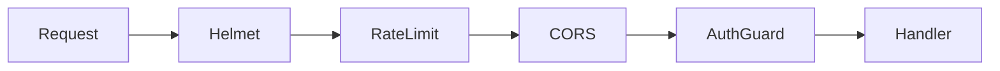

# Segurança

Visão em camadas do que o template aplica na **API** (do edge HTTP ao domínio). **Worker** não tem superfície HTTP — Helmet, CORS, rate limit, cookies e OpenAPI não entram nesse perfil. Escolha e flags: [Guia de instalação — API vs Worker](../inicio/guia-de-instalacao.md#api-vs-worker).

Detalhes de implementação ficam nos tópicos linkados; esta página responde **o que cada camada faz** e **que ameaça mitiga**.

## Fluxo da requisição

Ordem real no bootstrap (`applyHttpMiddleware`): Helmet → `cookie-parser` → rate limit → CORS. Guards (auth/autorização) atuam depois, no pipeline Nest.

## Resumo

| Camada | Escopo | Ameaça / risco mitigado |
| --- | --- | --- |
| Helmet | Core (API) | XSS refletido no browser, clickjacking, downgrade HTTPS |
| CORS | Core (API) | Leitura cross-origin indesejada no browser |
| Rate limit | Core (API) | Brute-force / abuso por IP |
| Cookie refresh httpOnly | Auth JWT | Exfiltração do refresh via JS do cliente (XSS) |
| Env Zod | Core | Boot com config inválida/insegura |
| Entrada Zod | Core | Dados malformados / superfície de injection |
| ErrorsFilter | Core | Vazamento de stack e internals |
| Autenticação | Opt-in | Acesso anônimo a rotas protegidas |
| Autorização | Opt-in | Escalação de perfil / uso indevido de rota |
| RedLock | Cache + cron | Dupla execução de CronJob em multi-réplica |

## Helmet (core)

**O que faz:** registra headers HTTP de segurança via [`helmet`](https://helmetjs.github.io/) em `applyHttpMiddleware`.

**O que busca assegurar:** reduzir impacto de XSS refletido no browser, clickjacking (`frameAncestors: 'none'`) e downgrade para HTTP em produção (HSTS + `upgradeInsecureRequests` só com `NODE_ENV=production`).

**Notas:** CSP libera `cdn.jsdelivr.net` (scripts/estilos/imagens) e `fonts.scalar.com` para o Scalar; `'unsafe-inline'` nos scripts/estilos; `crossOriginEmbedderPolicy: false` evita quebrar assets externos da doc.

Guia: [Middleware HTTP](./middleware-http.md#helmet-headers-de-segurança).

## CORS (core)

**O que faz:** controla quais origins o browser pode usar com `credentials: true`.

**O que busca assegurar:** impedir que um site arbitrário leia respostas autenticadas da API no browser. Default aberto (`origin: true`); restrinja com `CORS_ORIGINS`.

Guia: [Middleware HTTP](./middleware-http.md#cors) · [Variáveis de ambiente](../inicio/variaveis-de-ambiente.md).

## Rate limit (core)

**O que faz:** teto de requisições por IP na janela (`RATE_LIMIT_*`). Resposta **429** ao exceder.

**O que busca assegurar:** reduzir brute-force em login e abuso genérico. Desligado com `RATE_LIMIT_MAX=0` (default do template).

Guia: [Middleware HTTP](./middleware-http.md#rate-limit).

## Cookies / refresh httpOnly (auth JWT)

**O que faz:** no login, o refresh pode ir em cookie `httpOnly` (`path=/`). Em localhost (`API_HOST` contendo `localhost`): `SameSite=Strict` sem `Secure`. Fora disso: `SameSite=None` + `Secure` para XHR cross-site.

**O que busca assegurar:** limitar que script no cliente leia o refresh token (XSS). Access token continua tipicamente no body/header.

Guia: [Autenticação](./autenticacao.md).

## Validação de env (Zod, core)

**O que faz:** `EnvService` / schema Zod falha no boot se variáveis obrigatórias ou formatos estiverem errados.

**O que busca assegurar:** não subir com secrets/config ausentes ou inválidos (falha rápida vs falha silenciosa em runtime).

Guia: [Variáveis de ambiente](../inicio/variaveis-de-ambiente.md).

## Validação de entrada (Zod / RequestValidatorBase, core)

**O que faz:** validators na application rejeitam body/query/params fora do schema antes do handler de negócio.

**O que busca assegurar:** reduzir superfície de injection e dados malformados na borda da aplicação.

Guia: [Bases reutilizáveis](../core/bases-reutilizaveis.md).

## ErrorsFilter (core)

**O que faz:** filtro global mapeia Zod, TypeORM e exceções HTTP para respostas JSON previsíveis.

**O que busca assegurar:** não vazar stack traces nem detalhes internos ao cliente.

Guia: [Tratamento de erros](./tratamento-de-erros.md).

## Autenticação (opt-in)

**O que faz:** JWT RS256, OAuth2 e/ou API Key M2M — strategies no host; identidade disponível via `ILoggedUserInfoService`.

**O que busca assegurar:** só callers autenticados acessam rotas protegidas. Cada estratégia autentica um tipo de cliente (humano, IdP, máquina).

Guia: [Autenticação](./autenticacao.md).

## Autorização (opt-in)

**O que faz:** `AuthGuard` global, `@IsPublic()` para rotas abertas, `ProfilesGuard` / `@RestrictionByProfile` para perfil.

**O que busca assegurar:** separar **quem é** (autenticação) de **o que pode fazer** (autorização por perfil).

Guia: [Autenticação](./autenticacao.md) · [Rotas](./rotas.md).

## RedLock (cache + cron)

**O que faz:** lock distribuído (via cache) para CronJobs em múltiplas réplicas.

**O que busca assegurar:** integridade operacional — um job não corre em duplicata. **Não** é autenticação HTTP.

Guia: [Cache](../core/cache.md) · [Cron e Event Jobs](../core/cron-event-jobs.md).

## Próximos passos

- [Middleware HTTP](./middleware-http.md) — Helmet, CORS, cookies, rate limit
- [Autenticação](./autenticacao.md) — JWT, OAuth2, API Key, guards
- [Tratamento de erros](./tratamento-de-erros.md) — ErrorsFilter
- [Variáveis de ambiente](../inicio/variaveis-de-ambiente.md) — CORS, rate limit, JWT
