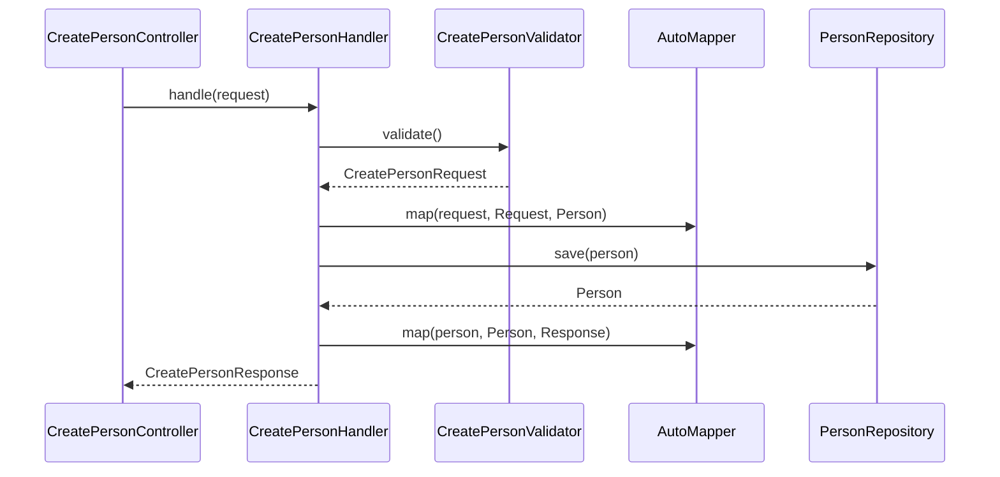

# Arquitetura DDD

O Koala Nest organiza o código em camadas com responsabilidades claras. Cada camada depende apenas das camadas internas, mantendo o domínio isolado de detalhes de infraestrutura e transporte HTTP.

## Camadas

| Camada | Pasta | Responsabilidade |
| --- | --- | --- |
| **Host** | `src/host` | Entrada HTTP: controllers, filtros, OpenAPI, módulos Nest |
| **Application** | `src/application` | Casos de uso: handlers, validators, requests/responses, mapeamentos |
| **Domain** | `src/domain` | Regras e modelos: entidades, DTOs de consulta, contratos de repositório |
| **Infra** | `src/infra` | Implementações concretas: TypeORM, repositórios, serviços externos |
| **Core** | `src/core` | Utilitários transversais: env, bases, ferramentas de mapeamento |

## Fluxo de uma requisição

O exemplo abaixo ilustra o caminho de `POST /person`:



## Inversão de dependência

O domínio define **contratos abstratos**; a infraestrutura fornece **implementações concretas**. O handler depende de `IPersonRepository`, não da classe TypeORM:

```typescript
// src/domain/repositories/iperson.repository.ts
export abstract class IPersonRepository {
  abstract findMany(query: PersonQueryDto): Promise<ListResponse<Person>>;
  abstract findById(id: number): Promise<Person | null>;
  abstract save(person: Person): Promise<Person>;
  abstract delete(person: Person): Promise<void>;
}
```

```typescript
// src/infra/repositories/repository.module.ts
@Module({
  imports: [DatabaseModule],
  providers: [{ provide: IPersonRepository, useClass: PersonRepository }],
  exports: [DatabaseModule, IPersonRepository],
})
export class RepositoryModule {}
```

## Composição de módulos Nest

A cadeia de imports conecta host → application → infra:

```typescript
// src/host/controllers/common/controller.module.ts
@Module({
  imports: [InfraModule],
  providers: [MappingProvider],
  exports: [InfraModule],
})
export class ControllerModule {}
```

```typescript
// src/host/controllers/person/person.module.ts
@Module({
  imports: [ControllerModule],
  controllers: [
    CreatePersonController,
    ReadPersonController,
    ReadManyPersonController,
    UpdatePersonController,
    DeletePersonController,
  ],
  providers: [
    CreatePersonHandler,
    ReadPersonHandler,
    ReadManyPersonHandler,
    UpdatePersonHandler,
    DeletePersonHandler,
  ],
})
export class PersonModule {}
```

## Leituras relacionadas

- [Handlers](../application/handlers.md)
- [Contratos de repositório](../domain/contratos-repositorio.md)
- [Controllers](../host/controllers.md)
